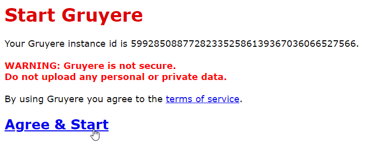
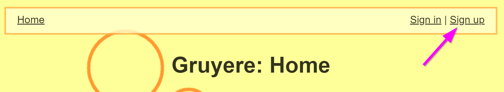
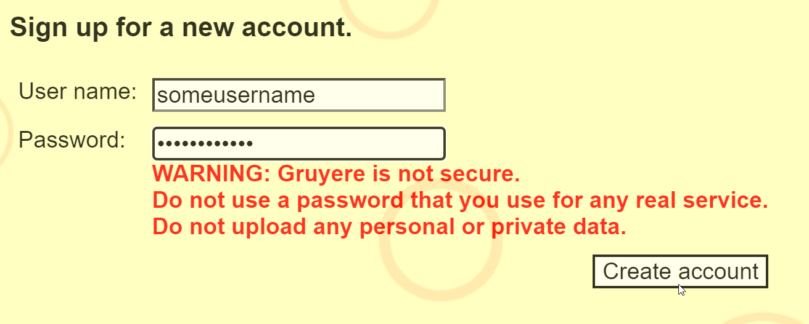
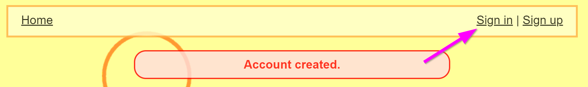
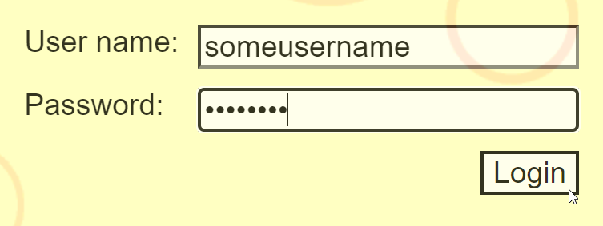
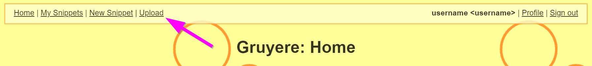
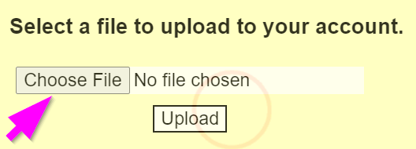
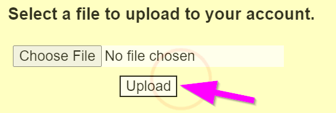
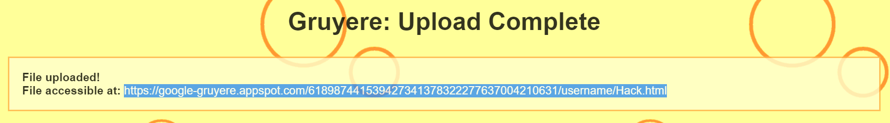
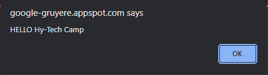

# Google Gruyere Follow-Along Activity
Follow the instructions below to see what it's like to hack a website!

## Getting Started
This activity will uses application called [Google Gruyere](https://google-gruyere.appspot.com/) - it's a website that is purposefully designed to _NOT_ be secure. It has several vulnerabilities ready to be exploited! In this case, we will be performing a [Cross Site Scripting (XSS) Attack](https://owasp.org/www-community/attacks/xss/).

1. Go to the Google Gruyere start page: [https://google-gruyere.appspot.com/start](https://google-gruyere.appspot.com/start)
1. Click on "Agree & Start" to spin up a new instance of the Gruyere application  
  
1. In the upper right, click on "Sign up"  
  
1. On the **Sign up** page, enter a username and password, and click the "Create account" button (making sure to note the warning)  
  
1. Next, click on "Sign in" in the upper right  
  
1. On the **Sign in** page, enter the username and password used to sign up, and click the "Login" button  
  

Now you have successfully created a Gruyere account! Note that this account will only exist on your specific instance of Gruyere.

## Creating the Hack
The next step is to create a file that will be used to hack Gruyere. It will be an HTML file that will execute some JavaScript code. On a secure website, there would be measures to prevent the execution of any scripts because hackers might send malicious code that could steal data or take down the site. In this case, the code will simply display a message whenever it runs.

1. Open a text editor (such as Notepad)
1. Copy and paste the following code into the file:  
  ```html
  <html>
    <head>
      <script>
        alert("HELLO Hy-Tech Camp");
      </script>
    </head>
  </html>
  ```
1. Once the code is there, save the file
  - Make sure to save the file as type "All Files"
  - The filename should be **Hack.html**

If you run into any trouble creating or saving the file, you can also download this file directly:

[Right-click this link and select "Save link as..." download the file.](Hack.html)

## Uploading the Hack
Now that the file has been created, it's time to upload it to Gruyere and hack the site!

1. Open up Gruyere
1. Click on "Upload" in the upper left  
  
1. Click the "Choose File" button  
  
1. Find the **Hack.html** file and select it
1. Click the "Upload" button  
  

After that, the exploit file should be accessible on the Gruyere site!

## Viewing the Hack
The next step is to view the file to run the exploit code. There should be a URL that appears on the **Upload Complete** page. Highlight that URL and copy it to the clipboard:



Next, open up a new browser tab, paste the URL into the address bar, and go to the page. When it loads, you should see a message that looks something like this:



That means that Gruyere ran the exploit code from the **Hack.html** file. You've successfully hacked Gruyere!